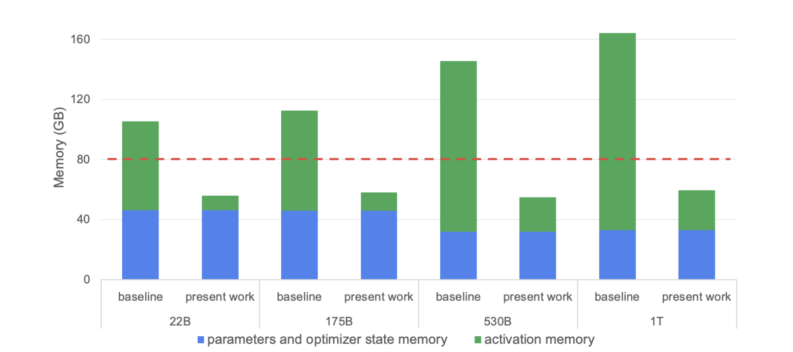
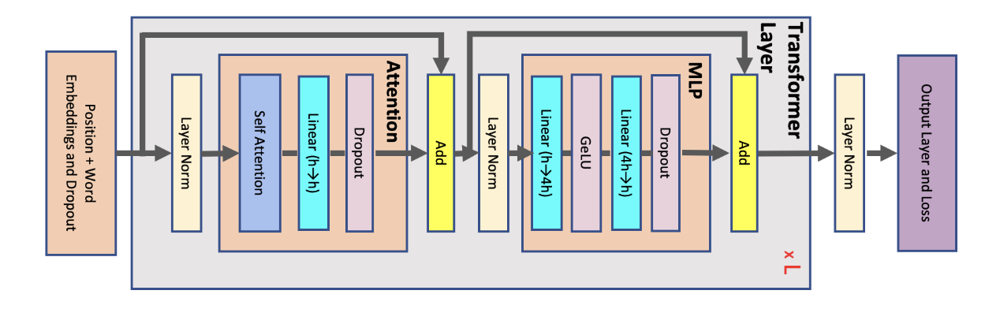
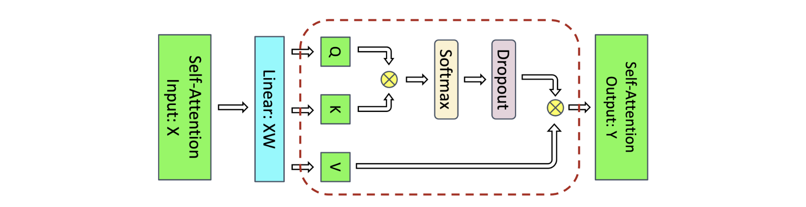
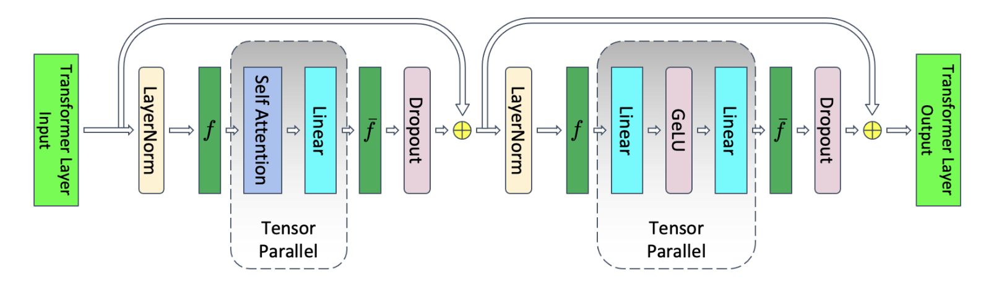
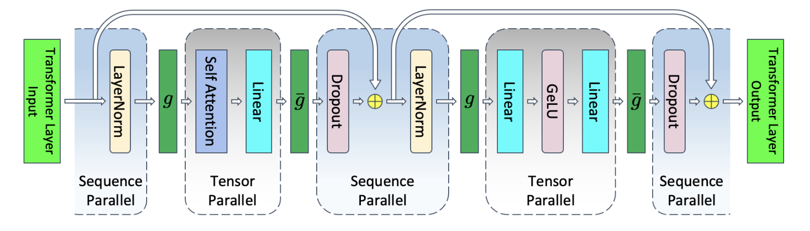
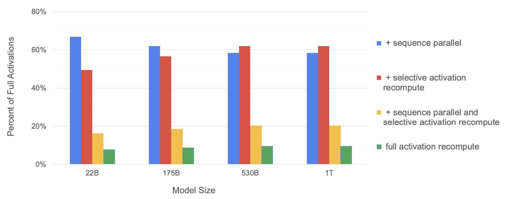

# 摘要

$\quad$ **挑战和目标**：本文针对现代AI领域训练大型Transformer模型的挑战，提出了可以显著加速训练的方法。作者通过减少激活重新计算来加速大型Transformer模型的训练过程。

$\quad$ **激活重计算**：激活重计算通常用于解决内存容量限制的问题。为了避免在反向传播中存储激活值，通常会重新计算这些值，这虽然节省了内存，但增加了冗余的计算。

$\quad$ **研究贡献**：作者展示了大部分冗余计算是不必要的，因为可以在不重计算的情况下，充分减少内存消耗。本文提出了两种新颖而简单的技术：序列并行（sequence parallelism）和选择性激活重计算（selective activation recomputation）。

$\quad$ **结合张量并行**：与张量并行结合使用时，这样几乎消除了重新计算激活值的需求。

$\quad$ **实验评估和成果**：作者在多达一万亿参数的语言模型上评估了他们的方法，并展示出该方法将激活内存减少了5倍，同时将由于激活重计算带来的执行时间开销减少了超过90%。

$\quad$ **训练530B参数GPT-3模型**：例如，在2240个NVIDIA A100 GPU上训练一个530B参数的GPT-3模型时，他们实现了54.2%的模型FLOPS利用率，比使用重计算时的42.1%快了29%。

$\quad$ **实现**：作者的实现将会在Megatron-LM和NeMoMegatron中提供。

# 1 介绍

$\quad$ **模型并行的需求与挑战**：Transformer模型参数规模达到数万亿，模型并行成为了必需。模型并行可以在设备间分配模型参数、激活值和优化器状态，使它们适应设备内存，并在合理的时间内完成训练。模型并行虽然线性减少了每个设备的参数数量，但在大量设备间分割模型会增加通信需求，形成了较小且性能较低的矩阵乘法操作，使得模型效率受到影响。

$\quad$ **内存压力的来源：激活值存储**：存储激活值成为扩展大型Transformer模型的关键问题。流水线并行需要存储多个微批次的激活值，以减少流水线空转，但它无法在保持高设备利用率的同时减少激活值的内存需求。

$\quad$ **内存需求量化及现有解决方案**：`图1`展示了不同模型配置所需的内存量，从220亿参数到1万亿参数。传统方法是不存储大部分激活值，而是在反向传播过程中根据需要重新计算它们，这种方法通常被称为“梯度检查点”或“激活重计算”。但这种方法会导致训练效率降低，观察到使用完全激活重计算时，执行时间开销增加了30-40%。

$\quad$ **减轻内存压力的新技术**：提出了旨在减轻存储激活值内存压力的新技术，这些技术特定于Transformer架构，易于实现且对计算效率影响微小。简要讨论了其他减少大型模型训练内存需求的技术，如数据并行级别的数据分区或将数据卸载到CPU内存。这些技术与作者提出的技术互为补充，但通常实现成本更高，对计算效率影响更大。

$\quad$ **激活内存需求的公式化与分析**：文章首先简要回顾了Transformer架构，然后构建了一个估算Transformer模型存储激活值所需内存的近似公式。利用这个公式可以研究不同形式的模型并行如何影响激活内存需求。

$\quad$ **序列并行和选择性激活重计算**：引入序列并行与张量并行，以避免在标准张量并行不利的区域中冗余存储激活值。通过在存储和重计算激活值中进行选择性操作，可以大大减少重计算的成本，同时只使用一小部分内存。

$\quad$ **实验评估**：最后，介绍了几项实验，衡量了这些技术对训练各个组成部分以及完整训练吞吐量的改进效果。

# 2 相关工作

$\quad$ **模型并行的需求**：模型并行允许在多个GPU上训练非常大的模型。模型参数及其相关的优化器状态需要大量内存，并且无法适应单个GPU。即使能够将模型适配到单个GPU（例如，通过在主机和设备内存之间交换参数），所需的高计算量可能导致训练时间过长，因此需要并行。

$\quad$ **常用模型并行形式**：通常用于在GPU上分配模型参数的两种模型并行形式是：
1. 张量并行，即跨多个设备分配每层的参数；
2. 流水线并行，即沿网络层维度分割模型。

一些最近的方法结合了这两种模型并行，以支持训练多达1T参数的大型模型。

$\quad$ **模型并行的替代方案**：模型并行的另一种替代方案是结合多种训练技术与数据并行，以支持大规模模型训练。这种方法基于在数据并行等级上分片优化器状态、梯度和参数。但与基于模型并行的技术相比，基于数据并行的技术效率较低，不适合大量GPU的扩展，因此更适合在资源受限的环境中对模型进行微调。本文仅关注模型并行优化。

$\quad$ **张量并行与序列并行的结合**：Megatron-LM中引入的张量并行在一定程度上有助于减少激活内存。在此方法中，Transformer的某些部分的激活没有在张量并行等级上分割，增加了激活内存开销。序列并行建议在整个网络中沿序列维度划分激活，可以缓解这个问题。然而，这种方法与数据并行类似，需要在所有设备上复制参数和优化器状态，不适合大型模型训练。Sagemaker和GSPMD提出了张量并行的内存高效版本，该版本在整个网络中沿隐藏维度在设备上分割激活。但这些方法的主要缺点是它们包括多设备层归一化，这在计算/通信上效率低下。

$\quad$ **本文提出的新技术**：利用张量并行和序列并行的优势，而没有上述方法的缺点。换句话说，作者将张量和序列并行结合起来，显著减少了激活内存，同时不增加任何额外的计算、通信或内存开销。

# 3 Transformer架构

$\quad$ **相关工作变量定义**：文中定义了以下变量，用于描述模型参数和并行化的方面：

表1: 变量名称
| 变量 | 描述                     | 变量 | 描述                     |
|------|------------------------|------|------------------------|
| $a$  | 注意力头的数量             | $p$  | 流水线并行大小             |
| $b$  | 微批量大小               | $s$  | 序列长度                 |
| $h$  | 隐藏层维度大小             | $t$  | 张量并行大小             |
| $L$  | Transformer层数        | $v$  | 词汇量大小               |

Transformer的结果如`图2`所示：

$\quad$ **单堆栈Transformer编码器或解码器**：Transformer考虑了一个包含 $L$ 层的单堆栈Transformer编码器或解码器。在网络的开始，输入token被送入一个大小为 $v \times h$ 的词嵌入表中，其中词嵌入与大小为 $s \times h$ 的学习位置嵌入结合，这里 $s$ 是序列长度，$h$ 是隐藏维度，$v$ 是词汇表大小。

$\quad$ **嵌入层的输出**：嵌入层的输出是传输到Transformer块的输入，是一个尺寸为 $s \times b \times h$ 的三维张量，其中 $b$ 是微批次大小。

$\quad$ **Transformer层的构成**：每个Transformer层由具有 $a$ 个注意力头的自注意力块组成，后跟一个包含两层MLP，这两层将隐藏大小增加到 $4h$，然后再次减少至 $h$。每个Transformer层的输入和输出大小相同，为 $s \times b \times h$。

$\quad$ **最后层的输出与交叉熵损失**：最后一个Transformer层的输出被投射回词汇维度，以计算交叉熵损失。假设词嵌入和输出层权重是共享的。

# 4 Activation Memory

$\quad$ **激活内存估算公式的推导**：作者推导了一个用于计算Transformer模型在前向传播中存储激活所需内存的近似公式。这里的“激活”是指在前向传播过程中产生且对反向传播中梯度计算必需的任何张量。公式中不包括模型主要参数和优化器状态，但包括例如dropout操作使用的掩码。

$\quad$ **主要内存占用成分的考虑**：只考虑内存的主要占用者，并忽略小的缓冲区。例如，对于层归一化块，计算梯度需要层的输入及其均值和方差。其中输入包含 $sbh$ 个元素，而均值和方差各有 $sb$ 个元素。由于 $h$ 较大（数量级为千），因此 $2sb \ll sbh$。因此，只考虑存储输入所需的内存是一个好的近似，即只包括 $sbh$，不包括 $sbh + 2sb$。

$\quad$ **网络和激活的存储格式**：假设网络和激活使用16位浮点格式存储，因此每个元素需要2字节的存储空间。例外是dropout掩码，它每个元素只需要一个字节。没有另外说明时，这里报告的所有大小都是以字节为单位，而不是元素数量。

## 4.1 Transformer层的激活内存

$\quad$ **每个Transformer层的激活内存**：
如`图2`所示，每个Transformer层由一个注意力块和一个MLP块组成，两者通过两个层归一化连接。下面将推导存储这些元素激活所需的内存：

$\quad$ **注意力块**：包括自注意力，后接线性投影和注意力dropout。线性投影存储其输入激活，大小为 $2sbh$，注意力dropout需要一个大小为 $sbh$ 的掩码。如`图3`所示，自注意力由几个元素组成：
   - **Query（$Q$）、Key（$K$）和Value（$V$）矩阵乘法**：只需要存储它们共享的输入，大小为 $2sbh$。
   - **$QK^T$ 矩阵乘法**：需要存储 $Q$ 和 $K$，总共 $4sbh$ 大小。
   - **Softmax**：Softmax输出需要 $2as^2b$ 大小，用于反向传播。
   - **Softmax dropout**：只需要一个大小为 $as^2b$ 的掩码。
   - **$V$ 上的注意力**：需要存储dropout输出 ($2as^2b$) 和值 ($2sbh$)，因此需要 $2as^2b + 2sbh$ 的存储空间。

汇总上面存储，注意力块总共需要 $11sbh + 5as^2b$ 字节的存储。

$\quad$ **MLP**：两个线性层分别存储它们的输入，大小为 $2sbh$ 和 $8sbh$。GeLU非线性也需要其输入大小为 $8sbh$ 以进行反向传播。最后，dropout存储其掩码，大小为 $sbh$。总的来说，MLP块需要 $19sbh$ 字节的存储。

$\quad$ **层归一化**：每个层归一化存储其输入，大小为 $2sbh$，因此总共需要 $4sbh$ 的存储。

$\quad$ **单层激活内存总计**：
综合注意力块、MLP和层归一化所需的内存，存储单个Transformer网络层的激活所需的内存为：
$\begin{equation}
    \text{无并行每层激活内存 = } sbh \left(34 + 5 \frac{as}{h}\right) \tag{1}
\end{equation}$ 

## 4.2 张量并行

$\quad$ **张量并行的基础**：论文中引用Megatron-lm的张量并行方法。这种方法被用来并行化注意力和MLP块，正如`图4`示所展现的那样。这种并行形式引入了两个额外的通信操作：$f$ 和 $\bar{f}$。

$\quad$ **并行的实际应用**：张量并行不仅在注意力和MLP块内并行化了模型参数和优化器状态，而且还并行化了这些块内的激活。需要注意的是，这些块的输入激活（例如 $Q$、$K$ 和 $V$ 矩阵乘法或 $h \rightarrow 4h$ 线性层的输入）并未被并行化，只有每个块内的激活被分配到了张量并行组中。

$\quad$ **减少激活内存的影响**：假设采用了 $t$ 路张量并行，每层存储激活所需的内存从原始公式减少为：
$\begin{equation}
    \text{张量并行每层激活内存 = } sbh \left(10 + \frac{24}{t} + 5 \frac{as}{ht}\right) \tag{2}
\end{equation}$
这一变化说明，通过张量并行，作者在保持计算效率的同时，降低了内存需求。

### 4.3 序列并行

$\quad$ **张量并行的计算效率**：作者首先强调了张量并行的计算效率。如`图4`这种方法并行化了训练中耗时最多的部分，比如注意力和MLP块，从而提高了计算效率。不过，它并未涉及层归一化和dropout部分，这些部分仍然在每个张量并行组中被复制，占用了大量激活内存。

$\quad$ **引入序列并行的必要性**：由于张量并行留下的这个空白，作者认为有必要引入序列并行。在Transformer层的非张量并行区域，操作沿序列维度是独立的，这样可以沿序列维度划分这些区域，以此来减少激活内存的需求。

$\quad$ **新的通信操作和转换器**：为了有效实施序列并行，作者介绍了新的通信操作 $g$ 和 $\bar{g}$，作为序列和张量并行区域之间的转换器。这些操作帮助减少了因为额外通信而带来的训练缓慢问题。

$\quad$ **实际应用中的序列并行**：作者以MLP块为例，展示了如何应用序列并行。通过将输入 $X$ 沿序列维度分割并对其进行处理，能够降低存储激活所需的内存，同时维持计算效率。

$\quad$ **减少激活内存的数学公式**：使用序列并行与张量并行相结合，Transformer层每层存储激活所需的内存显著减少。作者给出了相应的数学公式来阐述这一点：
$\begin{equation}
     \text{序列并行每层激活内存 = }  sbh \left(\frac{10}{t} +\frac{24}{t} + 5 \frac{as}{ht}\right) = \frac{sbh}{t} \left(34 + 5 \frac{as}{h}\right).  \tag{4}
\end{equation}$
这表明，通过结合使用这两种并行，可以在张量并行组中分布激活，并通过张量并行大小 $t$ 来显著减少内存需求。

## 4.4 流水线并行
$\quad$ **流水线并行的基本划分**：流水线并行将Transformer的 $L$ 层分为 $L/p$ 组，其中 $p$ 是流水线并行的大小。这种划分简单明了，但并不是均匀地将激活所需的总内存分配到每个分组。

$\quad$ **流水线泡沫和内存压力**：流水线并行的调度策略为了减少流水线泡沫，会在流水线的第一阶段施加最大的内存压力。这里的第一阶段指的是第一组 $L/p$ 层，其中也包括输入嵌入。

$\quad$ **1F1B流水线调度的特点**：为了量化这种内存分配，作者考虑了PipeDream开发的1F1B流水线调度策略。这种调度策略最小化了流水线泡沫，但使得流水线的第一阶段需要存储 $p$ 个微批次的激活，以保持流水线的压力，并避免额外的空闲时间。

$\quad$ **第一阶段激活内存的计算**：无论流水线并行大小 $p$ 如何，第一阶段必须存储价值 $L$ 层激活的内存。所以，第一阶段存储激活的总内存为：
$\begin{equation}
     \text{流水线并行总激活内存 = } \frac{sbhL}{t} \left(34 + 5 \frac{as}{h}\right).   \tag{5}
\end{equation}$

$\quad$ **不同调度策略下的内存需求**：对于不同的流水线调度策略，所需的总内存会有所不同。例如，Megatron-LM开发的交错调度策略要求存储 $L(1+\frac{p-1}{pm})$ 层的激活，其中 $m$ 是交错阶段的数量。因此，如果使用交错调度，总激活内存应按 $(1+\frac{p-1}{pm})$ 比例调整。

## 4.5 总激活内存
$\quad$ **总激活内存的主要组成**：大部分所需的激活内存可以通过流水线并行总激活内存`等式5` 来计算。但是，这个公式并没有涵盖输入嵌入、最后一层层归一化和输出层所需的激活内存。

$\quad$ **输入嵌入和层归一化的内存需求**：位置和词嵌入在反向传播中不需要存储大量激活，但dropout操作则需要。嵌入层中的dropout沿序列维度并行化，因此需要 $sbhp/t$ 的存储空间。需要注意的是，因子 $p$ 来自于流水线并行，因为需要存储 $p$ 个微批次的激活。

*$\quad$ *输出层的激活内存需求**：输出层前的层归一化同样使用序列并行，因此需要 $2sbh/t$ 的存储。输出层将其输入投射到词汇维度，需要存储大小为 $2sbh/t$ 的输入。最后，交叉熵损失需要存储以32位浮点数计算的对数几率，需要 $4sbv/t$ 的存储空间。由于只考虑流水线第一阶段的激活，因此以上激活（总共 $4sbh/t(1+v/h)$）只在没有流水线并行（$p=1$）的情况下包括。

$\quad$ **额外内存的计算公式**：将以上内存相加，由于输入嵌入、最后一层层归一化和输出层而引入的额外内存为：
$\frac{sbhL}{t} \left(\frac{p}{L} + \delta_{p=1}\frac{4}{L}\left(1+\frac{v}{h}\right)\right) $,
其中 $\delta_{p=1}$ 当 $p=1$ 时为1，否则为0。与公式 中的 $34+5\frac{as}{h}$ 相比，$p/L$ 和 $4/L(1+v/h)$ 都可以忽略不计。例如，对于一个拥有22B参数的模型，这些额外项占总激活内存需求的不到 $0.01\%$。因此`等式5` 是对所需总激活内存的一个很好的近似，将在本文的其余部分使用它。

# 5 选择性激活重计算的实践与影响

$\quad$ **面对大型模型的挑战**：即使使用了`等式5` 来计算所需的激活内存，对于大型模型来说，这个内存需求仍然是可观的。为了克服这一限制，作者提出了激活重计算方法，即在反向传播期间通过额外的前向传播来重计算所需的激活，同时存储（或"检查点"）一组层的输入激活。

$\quad$ **激活重计算对内存需求的减少**：这种方法将激活所需的总内存减少到 $2sbhL$。如果只在每个张量并行等级存储一部分激活，这个数值可以进一步减少到 $2sbhL/t$。但由于这种方法会增加通信开销，因此作者并未采用。

$\quad$ **平衡内存节约与计算开销**：与存储所有激活相比，检查点所有Transformer层能显著减少训练模型所需的内存，但这种减少是以增加计算时间（高达 $30-40\%$）为代价的。理想情况下，只需要检查点足够的激活来允许在设备内存限制下进行训练。序列并行提供的内存节约使得更多配置可以在无需重计算的情况下训练。

$\quad$ **选择性激活重计算的优势**：与其对完整的Transformer层进行检查点和重计算，不如只对占用大量内存但重计算成本较低的部分进行选择性激活重计算。例如，注意力操作（如 $QK^T$ 矩阵乘法、softmax、softmax dropout和对 $V$ 的注意力）通常有大的输入尺寸，因此有大量的激活，但每个输入元素的浮点操作数（FLOPs）很低。

$\quad$ **选择性激活重计算的具体效果**：使用选择性激活重计算，激活所需的内存从`等式5` 减少到：
$\begin{equation}
     \text{所需总内存 = } 34\frac{sbhL}{t}. \tag{6}
\end{equation}$
这表明选择性激活重计算允许所需激活内存与序列长度成线性关系，并独立于注意力头数量。对于GPT-3和MT-NLG模型，选择性激活重计算分别可以节省 $70\%$ 和 $65\%$ 的激活内存，同时只引入 $2.7\%$ 和 $1.6\%$ 的FLOPs开销。

$\quad$ **流水线并行中的应用**：在使用流水线并行时，即使给定设备只有 $L/p$ 层，第一阶段仍需存储相当于 $L$ 层的激活，因为它必须存储 $p$ 个微批次的激活以保持流水线压力。实践中发现，在应用序列并行和选择性激活重计算后，重计算开销足够小，以至于额外的技术提供的改进非常有限。

# 6 评估
**模型配置概述**：
$\quad$ 评估中使用了不同配置的模型，包括达到一万亿参数的大型模型。在所有模型中，张量并行大小设为8。175B和530B模型使用了具有三个交错阶段（$m=3$）的交错调度。所有情况下，序列长度设为2048，词汇量为51200。值得注意的是，这些评估中没有考虑数据并行，因此所用的批处理大小远低于端到端训练所用的批处理大小。所有结果均使用混合精度在Selene超级计算机上运行。

表3: 评估期间使用的模型配置
| 模型      | 注意力头数 | 隐藏层大小 | 层数 | 张量并行大小 | 流水线并行大小 | GPU数量 | 全局批量大小 | 微批量大小 |
|----------|------------|------------|------|--------------|----------------|---------|--------------|------------|
| 22B      | 64         | 6144       | 48   | 8            | 1              | 8       | 4            | 4          |
| 175B (GPT-3) | 96         | 12288      | 96   | 8            | 8              | 64      | 64           | 1          |
| 530B (MT-NLG) | 128        | 20480      | 105  | 8            | 35             | 280     | 280          | 1          |
| 1T       | 160        | 25600      | 128  | 8            | 64             | 512     | 512          | 1          |

**内存使用分析**：

 表2: 不同配置下的每层激活内存

| 配置                                   | 每层激活内存                        |
|--------------------------------------|----------------------------------|
| 无并行性                                | $sbh \left(34 + 5 \frac{as}{h}\right)$ |
| 张量并行 (基线)                          | $sbh \left(10 + \frac{24}{t} + 5 \frac{as}{ht}\right)$ |
| 张量 + 序列并行                          | $sbh \left(\frac{34}{t} + 5 \frac{as}{ht}\right)$ |
| 张量并行 + 选择性激活重计算                   | $sbh \left(10 + \frac{24}{t}\right)$  |
| 张量 + 序列并行 + 选择性激活重计算             | $sbh(\frac{34}{t})$                 |
| 完全激活重计算                           | $sbh(2)$                           |

$\quad$ 不同技术所需内存的总结显示在`表2`中。`图7` 展示了不同技术使用的激活内存，作为张量并行排名分割下所需内存的百分比。两种技术各自将内存需求减少了近一半，结合使用时能进一步降低5倍，将内存需求降至20%以下。不使用序列并行和选择性重计算的情况下，这些模型无法适应内存。

**每层执行时间分析**：

表4: 22B模型单层转换器的前向和反向传播时间

| 实验                   | 前向传播时间 (ms) | 反向传播时间 (ms) | 组合时间 (ms) | 开销 (\%) |
|----------------------|-----------------|-----------------|-------------|---------|
| 基线无重计算               | 7.7             | 11.9            | 19.6        | -       |
| 序列并行                  | 7.2             | 11.8            | 19.0        | $-3\%$  |
| 基线带重计算               | 7.7             | 19.5            | 27.2        | $39\%$  |
| 选择性重计算               | 7.7             | 13.2            | 20.9        | $7\%$   |
| 选择性 + 序列并行          | 7.2             | 13.1            | 20.3        | $4\%$   |

$\quad$ `表4` 显示了对22B模型进行的不同实验中，单个Transformer层前向和反向传播的执行时间。序列并行提供了微小的改进，将前向时间从7.7ms减少到7.2ms，加速了6%。选择性重计算的开销仅为1.3ms（11%），远低于整层重计算的7.6ms（64%）开销。结合使用序列并行和选择性重计算时，开销降至4%。

**端到端迭代时间分析**：
表 5: 端到端迭代时间,带来了约30%的吞吐量提升。

| 模型大小   | 迭代时间 (秒) | \multicolumn{2}{c|}{Throughput} | 模型FLOPs | 硬件FLOPs |
|------------|-------------|---------|-----------------|---------|------------|
|            | 完全重计算   | 当前工作 | 增长率           | 使用率   | 使用率       |
| 22B        | 1.42        | 1.10    | 29.0\%          | 41.5\%  | 43.7\%      |
| 175B       | 18.13       | 13.75   | 31.8\%          | 51.4\%  | 52.8\%      |
| 530B       | 49.05       | 37.83   | 29.7\%          | 56.0\%  | 57.0\%      |
| 1T         | 94.42       | 71.49   | 32.1\%          | 56.3\%  | 57.0\%      |

$\quad$ `表5`列出了`表3`中列出的四种配置的端到端迭代时间。发现在所有测试配置中，提供了29.0%至32.1%的吞吐量提升，这些节省将直接转化为更短的训练时间。

# 7 结论
结论及未来工作方向

1. **技术创新及其成效**：在这项工作中，提出了两种新颖而简单的技术，它们减少了存储激活所带来的内存压力，从而减少了重计算激活的需求。展示了如何通过结合使用序列并行和张量并行显著减少所需的激活内存。结合选择性激活重计算，实现了内存的5倍减少，并恢复了使用完全激活重计算引入的90%以上的计算开销。

2. **未来工作的方向**：未来，计划通过解决大微批次引起的内存碎片问题和流水线并行导致的非均匀内存分配问题，进一步减少激活内存。此外，还计划研究减少流水线第一阶段内存压力的方法。

$\quad$ 这项研究为大型Transformer模型的训练提供了重要的内存优化方案，并展示了显著的效果。未来工作将继续探索在大规模模型训练中优化内存和计算资源的新途径。

