# LLM之前世、今生与未来

# 1 大语言模型：NLP技术的奇点时刻

## 1.1 技术探索：深度学习加速推进数据的无损压缩

**人类对机器智能的探索由来已久**:

$\quad$ 如何让机器像人类一样思考，获得与人类相当的智能，一直是全球人工智能学者毕生追求的圣杯。自英国数学家阿兰·图灵在1950 年提出了“机器能思考吗”这一跨世纪的命题以来，人类就从未停止对机器智能的探索。从最简单的统计规则方法，到借鉴人类大脑生物结构的神经网络模型，再到如今拥有千亿级参数的超大规模预训练模型，深度学习因其能够实现非线性空间的有效变换，并能利用GPU等硬件实现加速计算，因而成为人工智研究领域的核心主线。无论是早期的RNN，还是其改进后的变体LSTM，亦或是本轮生成式AI浪潮的起源 Transformer，**它们本质上都是用一个更有效的神经网络去实现数据的无损压缩，而数据的压缩能力或许就是机器智能的一种展现。**

**工智能底层算法的探索历程**:

|时间 |事件｜
| ----------- | ------------------- |
|1958 年| 计算机科学家罗森布拉特提出了由两层神经元构成的神经网络，这种网络被称为感知机（Perceptron），是最基本的神经网络结构|
|1982 年| 约翰·霍普菲尔德提出了一种具有记忆存储能力的 Hopfield 网络，开启了循环神经网络（Recurrent Neural Network, RNN）的时代，也是 LSTM（Long Short-Term Memory）、Transfomer 模型的奠基者
|1986 年 |“AI 教父”杰弗里·辛顿发明了适用于多层感知器的反向传播算法，它成为了日后训练深度神经网络的基础|
|1989 年| 杨立昆（现任 Facebook 首席人工智能科学家）等人提出了卷积神经网络（CNN，Convolutional Neural Networks），被广泛应用于计算机视觉的图像处理领域|
|2012 年| AlexNet（一种卷积神经网络模型）引入了利用 GPU 并行运算，以压倒性的准确率夺得了当年ImageNet 图像识别大赛的冠军。这一成果带来了深度神经网络的又一次复兴（其中，论文的第二作者是未来 OpenAI 的首席科学家 Ilya Sutskever）|
|2016 年| AlphaGo, 这台由谷歌DeepMind开发的先进的人工智能棋手，出人意料地击败了强大的围棋世界冠军李世石，体现了人工智能在围棋这项历史悠久、被誉为人类智慧皇冠上的明珠的棋类运动中，取得了巨大的突破
|2017 年 |谷歌机器翻译团队在发表的一篇具有里程碑意义的论文《Attention is All You Need》中，精确提出了一种采用 Attention 机制的全新模型——Transformer。Bert、GPT 等预训练模型随之孕育而生|

## 1.2 技术应用：预训练语言模型成为 NLP 主流
**从单一小模型到预训练模型的范式转移**:

$\quad$ 语言模型的本质是对任意一段文本序列进行概率建模，用一个高维向量来表示一个 token 的全部特征。
+ 早期的研究者发明了 Word2Vec，一种用于将自然语言中的单词表示为向量的技术，它基于神经网络，并且可以通过训练大规模语料库来学习单词之间的语义和语法关系，是深度学习应用在 NLP 领域的早期范式；
+ 随着对长文本特征提取能力更强，计算效率更高的神经网络的提出，研究者开始尝试用更多的数据去训练一个能力更强的模型——预训练模型，然后通过迁移学习的方法使其适用于下游特定的任务。这就是 Google 在 2018 年提出的 BERT（Bidirectional Encoder Representation from Transformers，基于Transformer 的双向编码器）的核心思想；
+ 然而，OpenAI 在这一时期坚定押注于 GPT（Generative Pre-Trained Transformer，基于 Transformer 的单向解码器）这一路线，坚信通过优化“下一个词预测”，以及扩大训练模型的参数量和数据量，机器能够对文本语料拥有与人类相似的“理解”能力。当前，OpenAI 与 ChatGPT 的成功，使得运用大语言模型做“预训练+提示”的范式，逐步取代了 BERT 时代“预训练+下游任务改造”的范式，成为了 NLP 业内新的主流。

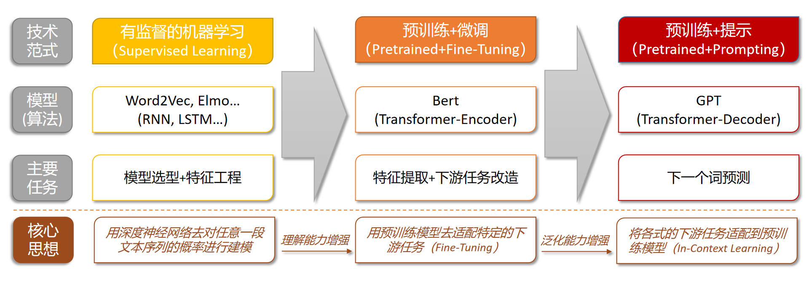

## 1.3 技术跃迁：大语言模型可能打开通往AGI之路

$\quad$ 直到2022年底ChatGPT发布，学界和工业界开始意识到，OpenAI 对生成类模型（GPT）和算法规模化（Scalability）的两个基础技术路线押注，可能是让机器获得智能的可行路径，甚至是打开通往通用人工智能（AGI，Artificial General Intelligence）这一终极理想的金钥匙。因此，我们可以认为，当前以ChatGPT 为代表的大语言模型开启的本轮科技浪潮，其重要性可能高于过去任何一次 AI 技术的突破，实现 AGI 的愿景可能已并不遥远。当然，技术的突破与未来的潜在瓶颈也正都源于此，大模型与生俱来的 Hallucination（幻觉）使其输出的内容天生具有可靠性低的特点；另一方面，大模型的模型规模化能力的天花板也有待进一步探索。因此，提升模型可靠性和提升模型性能共同构成了大模型未来迭代的核心靶点。
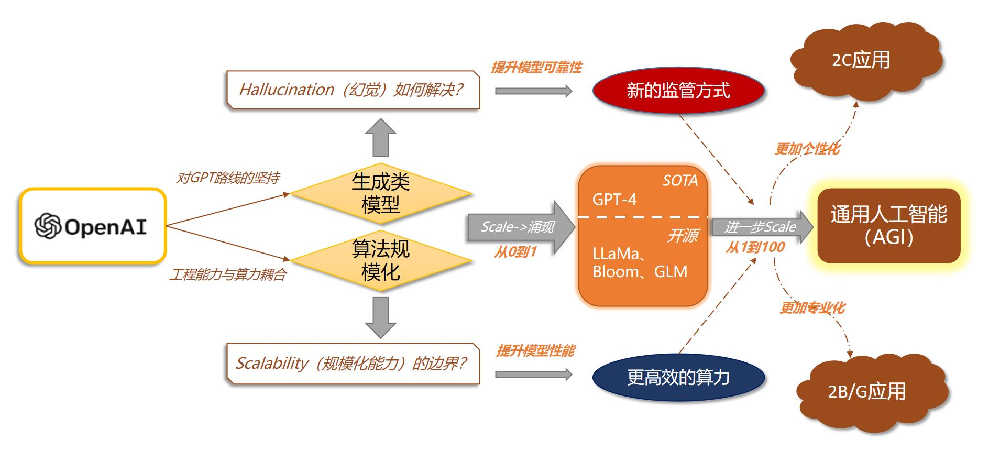

# 2 OpenAI 与 GPT：算法、工程、商业的融合
## 2.1 GPT 系列模型的发展历程：千锤百炼，终见“涌现”

+ 对 GPT 路线的执着探索（GPT-1~3）：2018 年 6 月，OpenAI 推出基于
Transformer Decoder 改造的 GPT-1，但其在下游理解类任务的性能远低于同
年 10 月 Google 推出的基于 Encoder 的 BERT；2019 年 GPT-2 推出后，尽管
性能仍不如 BERT，但 OpenAI 发现 Zero-shot 和 Few-shot 的方式可能可以
直接训练一个通用的语言模型；到了 2020 年的 GPT-3，OpenAI 决定直接将
模型参数扩大到了 175B，这一举动正式掀开了大语言模型的序幕；
+ 涌现能力的出现（GPT-3.5）：OpenAI 在 GPT-3 的基础上通过融合指令微调
训练得到的 InstructGPT、基于代码数据训练的 Codex、以及基于人类反馈
的强化学习（RLHF，Reinforcement Learning from Human Feedback），训练
得到了 GPT-3.5，某种意义上实现了大模型能力的“涌现”（在某些复杂能力
上实现突破）。GPT-3.5 也成为了开启本轮生成式AI浪潮的爆款产品
ChatGPT背后的核心功臣。
+AGI的曙光已现（GPT-4）：2023年3月，OpenAI发布了基于GPT-3.5的
SOTA（State-Of-The-Art）模型GPT-4，该模型在多模态和可靠性方面实现
了进一步扩展。从泛化能力的角度，GPT-4在创造力、图片理解能力、长文
本处理能力和回答准确性方面都有所提升；从工程能力的角度看，通过与
Azure在算力设施上深度定制合作，GPT-4能够以千分之一的计算量去预测
在一定计算规模下的性能（预测最终模型的Loss）；从可靠性的角度，GPT-
4自去年8月训练完成后，花费了大量时间做对齐（Alignment），甚至不惜
牺牲部分性能以提升其内容输出的可靠性。

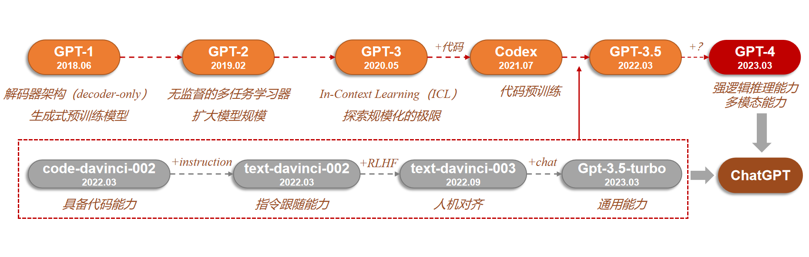

## 2.2如何训练一个ChatGPT：预训练获得“智商”，指令微调提升“情商”
$\quad$ 模型的训练可分解为预训练基座模型和基座模型的微调。基座模型（Base 
Model）是经过海量数据预训练（Pre-train）所得到，它具备一定的通用能力，
并将消耗千卡级别的 GPU 算力。这一阶段模型获得了知识，具备了“智商”；但
基座模型往往不能很好地胜任下游的各式任务，以 ChatGPT 为例，模型需要通
过指令微调，才能具备与人类流畅对话的能力（其中数据集需要包含各种与人类
行为、情感相关的指令和任务），使得基座模型在预训练阶段获得的能力被进一
步解锁/激发出来，从而实现从“智商”到“情商”的跨越。值得一提的是，模
型微调不可避免将带来某些性能上的取舍，例如 OpenAI 在他们的指令微调论文
中称其为“对齐税” (alignment tax)。
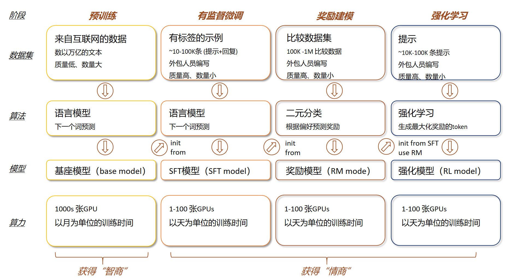

## 2.3 模型智能的“涌现”是生成式 AI 浪潮的充要条件

**模型能力的涌现是生成式AI浪潮的充要条件**:

$\quad$ 过去，模型的表现被认为与模型的规模之间服从Power Law，即随着模型规模指数级上升，模型性能只能线性增长；但Google的研究者在2022年发现，当模型规模达到某个阈值时，模型对某些复杂问题的处理性能突然呈现快速增长，这种现象则被称为Emergent Abilities，即涌现能力。例如，研究者发现当大语言模型规模达到一定程度时，思维链提示（Chain of Thought prompting，CoT）可以显著提升大语言模型的性能，尤其适用于处理涉及数学或推理的复杂任务：
+ Zero-shot-CoT：在prompt提问的结尾只需附加“Let's think step by step”这几个词；
+ Few-shot-CoT：在prompt中给与一些关键推理步骤的示例，让模型学习相应的推理过程；

$\quad$ CoT的意义在于模型可能已经学到了底层的推理过程而非统计意义上记住了输入-输出的概率分布，这是模型拥有“智能”的一个重要体现，也显著打开了大语言模型未来应用的可为空间。

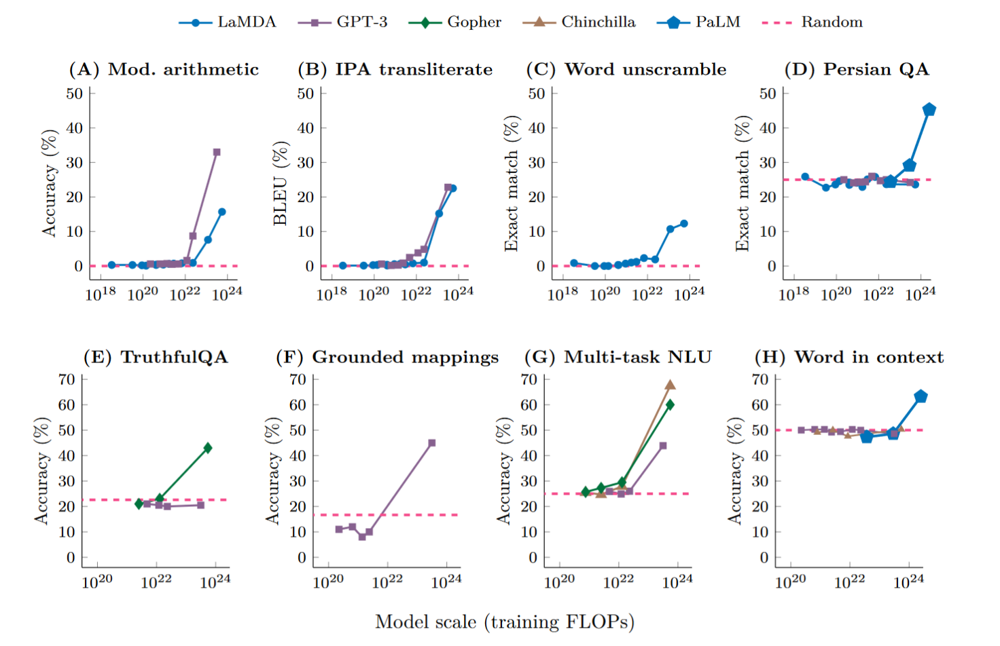
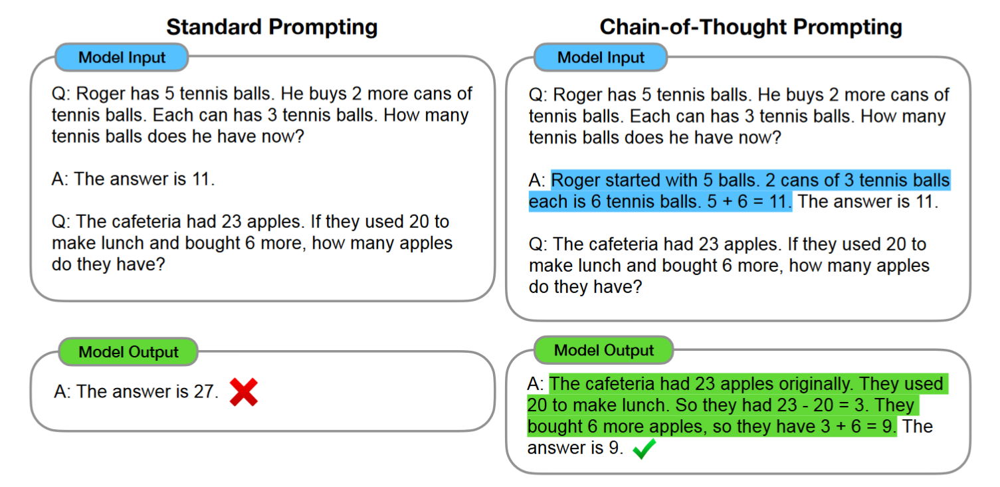

# 3 大模型应用：数据感知与代理（Agent）能力

## 3.1 外部数据：三条融合垂域数据打造大模型的技术路径
大模型与垂直领域Know-how的融合是商业化落地关键。如何将个人的个性化私有数据和企业多年积累的行业专有知识嫁接到大模型的通用能力上，是大模型在垂直领域商业化落地的核心技术问题。目前开发者主要采用三种思路：
+ 方案1：先通过大量的垂域语料数据+通用语料数据做预训练，再针对性地做指令微调（从头训练模型）；
+ 方案2：在一个通用大模型的基础上，通过指令微调将垂域知识训练到模型的参数中（小幅改动模型）；
+ 方案3：在一个通用大模型的基础上，通过上下文学习（In-Context Learning）将垂域知识放在模型的提示词Prompt中（不训练模型，用模型）。

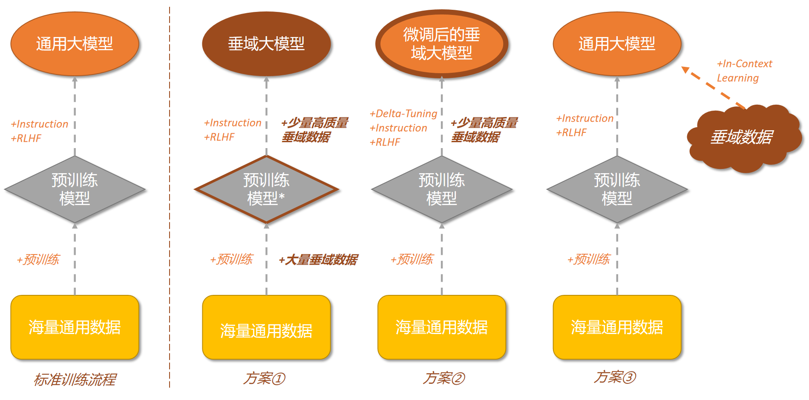

$\quad$ 方案1实现难度最大，模型对垂域知识的零样本学习能力最强（Zero-shot），算力消耗集中在预训练。方案1对垂域数据的质量和数量要求都很高，且需要从头训练一个基座模型的工程能力和算力储备，但是一旦训练成功，模型推理泛化能力理论上是最好的（大语言模型的知识是在预训练阶段获得的）。因此，方案1适合于有大量垂域数据和算力购买能力的大型公司；

$\quad$ 方案2实现难度次之，模型能够具备一定的垂域知识零样本学习能力，算力消耗集中在微调和推理。方案2本质是借鉴了Bert做下游任务改造的思路。然而，对大模型的微调实则将预训练阶段获得的能力以某种方式激发出来，但这种能力的激发是有代价的，包括但不限于会出现原有知识/能力的遗忘。此外，微调后的模型通用能力上限依然受制于基座模型本身。因此，方案2适合具有丰富调节参数经验团队的模型或应用厂商；

$\quad$ 方案3实现难度最低，模型不具备垂域知识的零样本学习能力，算力消耗集中在推理端。方案3是将垂域数据保存在一个外挂的向量数据库中，通过In-Context Learning让大模型在prompt中学习相关信息。方案③其实就是大家口中经常讲的MaaS（Model as a Service）。这一方式实现起来方便快捷，并且能够快速实现外部数据的更新，目前主要瓶颈是大语言模型对prompt中输入上下文长度（In-ContextLength）的支持。

$\quad$ 值得一提的是，方案3并不完全和方案1、2独立，它们之间可以相互组合，特别是在一些需要高频更新外部数据的应用场景，方案3是唯一能适用的办法；此外，方案3为下游客户提供了一个低成本、少量数据的“冷启动”的方式，非常适合想要快速尝鲜大模型功能的下游客户。

# 3.1.1 Fine-Tuning与In-Context Learning的实现方式案例

**Delta-Tuning是对大模型参数高效的微调范式**:

$\quad$ 当大模型的规模越来越大时，做全局的微调，即重新训练所有的模型参数无疑会变得愈发不可行，亟需一种参数高效（Parameter-efficient）的新范式。清华与智源研究院在《Delta Tuning:A Comprehensive Study of Parameter Efficient Methods for Pre-trained Language  Models》论文中对解决上述问题的方法进行了总结，这些方法本质上都是在尽量不改变原有模型参数的情况下引入一个增量参数（Delta Paremters）进行微调，因此将它命名为Delta-Tuning。在众多Delta-Tuning的实践中，最被开发者广泛关注和使用的，当属微软提出的LoRA（Low-RankAdaptation of Large Language Models，大语言模型的低阶适应）。LoRA的原理是冻结预先训练好的模型参数，在Transformer架构的每一层注入一个可训练的低秩矩阵，并在模型训练过程中只训练降维矩阵A与升维矩阵B（下图橙色部分），其本质是基于大语言模型内在的低秩特性，增加旁路矩阵来模拟全参数微调。以微调175B参数的GPT-3为例，与Adam调优的GPT-3相比，LoRA可训练参数量减少了1万倍，GPU内存需求减少了3倍，显著降低了微调模型的成本。

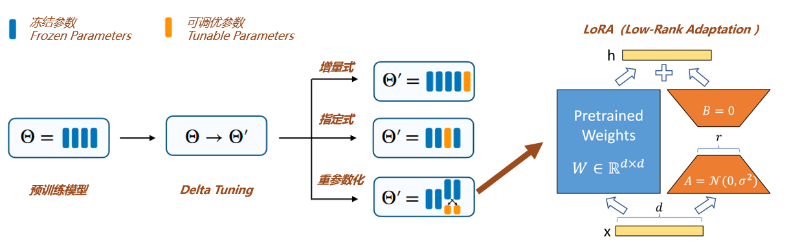

**Langchain+向量数据库打造企业专属知识库问答系统**:

$\quad$ LangChain是一套强大的大模型应用开发框架，集成了模型I/0、数据连接、链、代理、内存、回调等模块，赋予了大模型：1）数据感知（可连接其他的外部数据源）、2）代理能力（允许大模型与环境互动）。在LangChain的帮助下，开发者可以更加便捷的将大语言模型这一“大脑”装上“四肢”，赋予其访问本地文件、调用API接口、访问互联网等进阶能力，快速打造知识库问答、聊天机器人、结构化数据分析等功能。因此，使用LangChain将大模型与企业的垂域知识库连接（通常以向量数据库的形式），将用户输入的prompt在向量数据库中检索最相关的内容，再将返回的内容和输入的prompt本身一起成为输入给大模型的最终prompt，成为了另一种可实现“大模型的通用能力+垂直领域的专业知识”的技术路径。

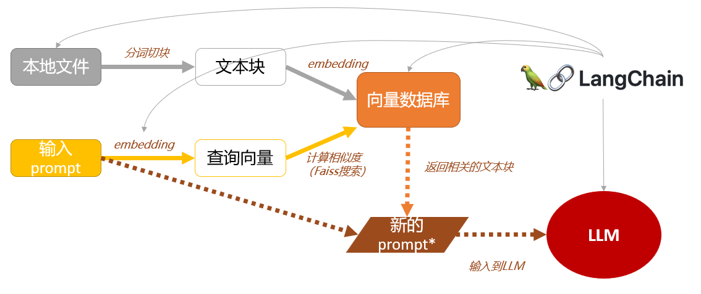

## 3.2代理（Agent）：为大模型加上四肢，强化复杂任务处理能力

**提示工程的下一个前沿**:

$\quad$ 通过增加代理能力（Agent），让大语言模型具备自主理解、规划、执行复杂任务的能力，彻底改变传统的人机交互方式，是当前应用侧探讨的另一个热门方向。目前大模型的代理能力可以体现在两方面：1）允许单个大模型使用工具、2）允许多个大模型协作竞争。OpenAI 安全系统负责人Lilian Weng近期发表相关博文，她认为在大语言模型驱动的AI智能体中，大语言模型扮演了“大脑”的角色，规划（任务分解+反思总结）、记忆（短期记忆+长期记忆）、工具使用（调用API+访问外部数据）是实现它的三个核心组件。此前在GitHub上关注度极高的AutoGPT项目实现了对大语言模型的循环调用，本质上是对大语言模型代理能力的充分呈现，因此也被称为“提示工程的下一个前沿”。

### 3.2.1 与计算机内部交互：插件（Plugins）与代码解释器（Code Interpreter）
$\quad$ GPT-4插件开放生态不断丰富，代码解释器大幅提高用户工作效率。2023年5月，OpenAI发布首批70余款插件（plugins），使GPT-4能通过插件检索互联网实时数据、调用公司或个人资料库、执行订机票等操作。插件功能的本质是在输入ChatGPT的prompt中增加一段备选插件的“API生成手册”，是一种赋予大模型代理能力实现与计算机环境进行交互的经典案例。2023年7月，ChatGPT的代码解释器插件Code Interpreter正式向所有Plus用户开放。代码解释器具备以下功能:使用Python进行编程、处理上传和下载、在受保护的沙箱化执行环境中运行、持久会话等，用户可直接使用自然语言要求ChatGPT读取文件（100M以内）、分析编辑数据以及生成图片、视频、代码等。代码解释器是典型的让模型使用工具的产品，这代表了大模型应用未来发展的底层范式，即应用开发将是一种趋势。
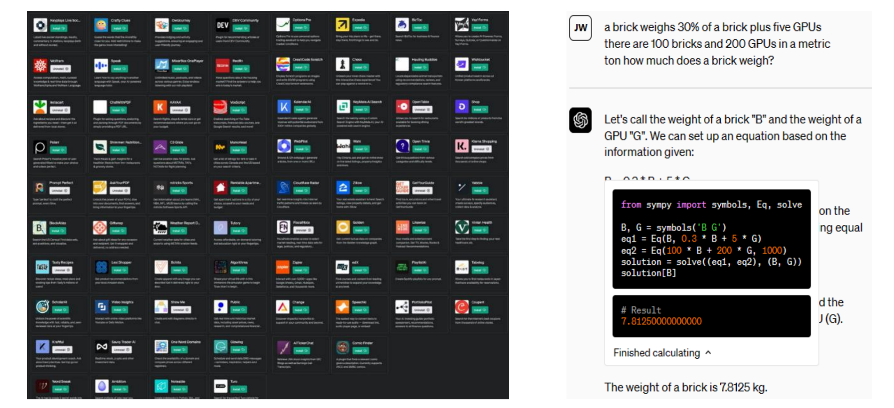

### 3.2.2 与物理世界交互：Robotics Transformer 2（RT-2）
$\quad$ 谷歌发布机器人RT-2，打开大模型与物理世界的交互窗口。2023年7月，谷歌DeepMind推出新款机器人模型Robotics Transformer 2（RT-2）。RT-2是全新的视觉-语言-动作（VLA）模型，可以从互联网和机器人数据中自动学习，并将这些知识转化为机器人控制的通用指令以实现一系列操作动作。同时，在思维推理链加持下，RT-2可执行深度语义推理完成复杂度更高的任务，类似于实体机器人版的ChatGPT。

- 例如，人类发出指示：我需要锤钉子，场景中的什么物体可能有用？
- 机器人计划：选择桌上的石头；
- 机器人行动：1 129 138 122 132 132 106 127（该字符串为机器人动作标记的数列）。

$\quad$ RT-2展示了构建通用机器人的前景，打开了大模型与物理世界的交互窗口。随着多模态融合的大模型日益成熟，以及以人形机器人为代表的新物理载体在硬件端迭代升级，大模型的代理能力将被赋予更丰富的含义。
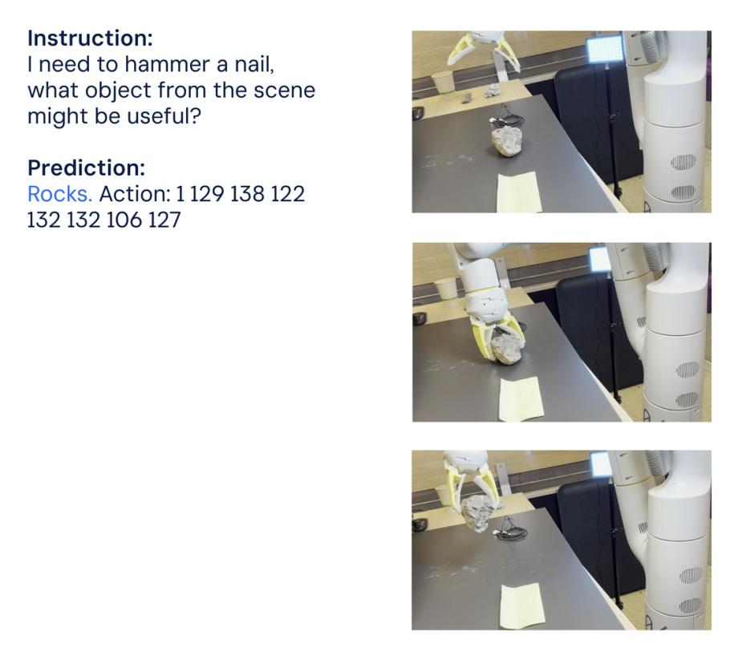

## 3.3上下文长度：应用创新的关键靶点
**上下文长度决定提示工程的复杂度**:

$\quad$ 如前文所述，以GPT为代表的大语言模型带来的范式转移，是用户只需要将完成任务所需信息输入到prompt中（In-Context-Learning），而无需将这些信息训练到模型的参数中（Fine-Tuning）。无论是3.1介绍的引入外部数据的方案③（外挂向量数据库），还是3.2介绍的代理能力（Agent），其本质都是一种提示工程（Prompt Engineering）。基于此，上下文长度的拓展可能是推动应用落地的关键靶点：
+ **更长的上下文长度->更大的提示工程潜力->功能更强大的大模型应用**

$\quad$ 但实际使用中，大模型支持的最大上下文长度往往存在限制（GPT-4目前最大支持32k，Claude可支持100k，初代开源的LLaMa只支持2k，LLaMa2.0则升级到了4k）。存在该限制的主要原因是：1）过长的输入会使模型在推理时计算和内存资源使用急剧扩大（Transformer的计算复杂度和空间复杂度随序列长度N 呈二次方增长）、2）过长的训练数据也可能因为关联问题带来模型质量的下降（Attention机制对长文本的中间记忆能力较弱）。为了实现提升大模型支持的最大上下文长度，开发者尝试了多种方式，包括但不限于更好的位置编码（ALiBi，Attentionwith Linear Biases）、稀疏注意力机制、FlashAttention（用于GPU的注意力层高效实现）、多查询注意力（Multi-QueryAttention，MQA）等等。

|模型名称 | 最高输入 | 发布者 | 开源情况|
|-------|---------|-------|--------|
|Claude-1.3-100K| 100K| Anthropic| 商用
MPT-7B-storywriter| 65K| MosaicML| 开源且免费商用
ChatGLM2-6B| 32K| 清华&智谱| 开源但收费商用
GPT-4-32k| 32K| OpenAl| 商用| 
LongChat-13B-16K| 16K| LM-SYS| 开源但不可商用
GPT-3.5-Turbo-16K| 16K| OpenAl| 商用
MPT-30B-chat| 8K| MosaicML| 开源但不可商用
XGen-7B 系列| 8K| Salesforce| 部分开源且免费商用
PaLM 2| 8K| Google| 商用
LLaMa 2| 4K| Meta| 开源且免费商用
LLaMa 1| 2K| Meta| 开源但不可商用

## 3.4 “大”模型“小”型化：应用落地的降本之道

**模型小型化技术主要包括压缩参数和压缩结构**:

$\quad$ 大模型应用落地的另一个关键堵点是推理成本的高企，除了以英伟达为代表的加速计算厂商在硬件侧持续降本外，对模型本身进行压缩以降低推理成本。模型小型化是指在保持模型精度的前提下，通过压缩模型参数和结构，将已经训练好的大型模型缩小为能够在边缘端或其他资源受限环境中运行的精简小型模型。根据《深度学习模型压缩与加速综述》中的分类，压缩参数的主要方法包括：参数剪枝、参数量化、低秩分解和参数共享等；压缩结构的主要方法包括紧凑网络和知识蒸馏等。

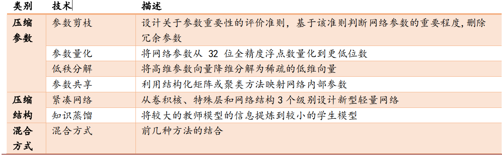
**参数量化是目前降低模型推理成本的主流技术路径**:

$\quad$ 计算量(FLOPs)对应的是时间复杂度，主要关注网络执行时间的长短，即衡量每秒浮点运算次数；参数量(Params)对应的是空间复杂度，主要关注显存占用量，即衡量网络模型中需要训练的参数总数。当前，参数量化是目前降低模型推理成本的主流技术路径，其核心思想是通过将浮点计算转成低比特定点计算以降低数据精度，有效降低模型计算强度、参数大小和内存消耗，即以牺牲部分模型性能为代价提升计算效率。Yufan Liu等人的研究结果显示，当模型的FLOPs数量修剪为原来的50%左右时，模型牺牲的准确度约10%；即当接受约10%的性能牺牲时，可以节约50%左右的算力成本。

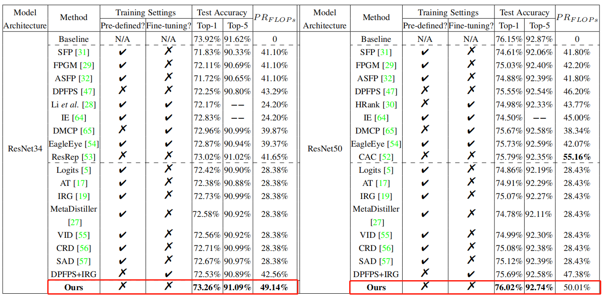

# 4 应用分析框架：通用能力与外部能力的组合

$\quad$ 大模型应用可以被总结为，在基座模型的通用能力上，叠加一些其他的可实现的外部能力。以当前较有代表性的LangChain为例，它可以为大模型提供数据感知（可连接其他外部数据源）和代理能力（允许大模型与环境互动）。根据这一范式，将现阶段大模型的应用边界归纳为通用认知能力与上述两种外部能力的排列组合。基于此，展望未来大模型新应用的靶点可总结为：
+ 通用能力的增强（上下文长度、复杂推理、数学、代码、多模态等）
+ 外部能力的扩充（处理非结构化数据、使用更复杂的工具、与物理世界的交互等）

1.通用能力＋数据感知= 信息检索、汇总、再生成
* a.多轮对话机器人
    * 2C->虚拟人 AI助手、智能客服、AI 家教、智能硬件..
    * 2B->企业知识库问答、OA 私人助理、营销机器人、培训机器人
* b. 数据特征挖掘器
    * 2C->基础数据分析、个性化营销、智能问诊.
    * 2B-> 商业分析、网安攻击关联分析..
* c.特定内容生成器
    * 2C-> 办公场景（Word、PPT）、创作场景（图片、视频）、代码.
    * 2B-> 金融报表、法律文件、研究报告、病例.

2.通用能力＋代理能力=自主执行、循环调用、环境控制
* d. 机器人流程自动化（RPA）
    * 2C-> 第三方 Plugins、代码解释器、办公场景（Excel）..
    * 2B-> 智能 OA、智能中台、低代码平台.
* e.任务解决型自主 AI
    * 2C →> AutoGPT, AgentGPT, BabyAGI, GPT-Engineer...