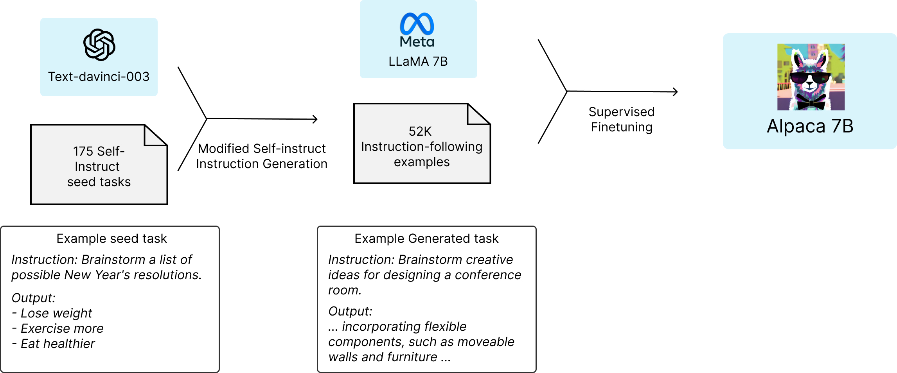
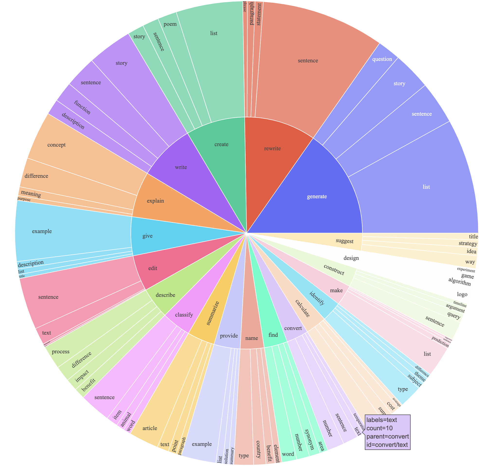
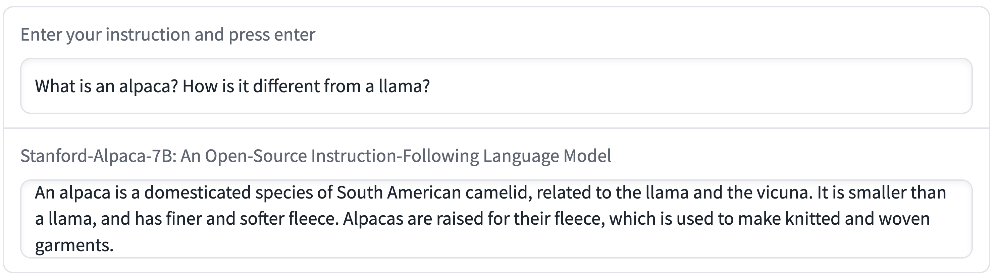

# LLM之大模型之Alpaca 7B模型解析

去年Alpaca 7B模型，不仅展示了在处理指令遵循任务上的出色能力，还因其相对小的规模和低廉的复现成本而引起了大家的注意。在本篇博客中，汇总了官方报告和官方Git的内容，通过阅读可以了解Alpaca 7B模型的起源、训练过程、性能评估以及其潜在的应用和限制。我们还将探讨其在人工智能研究领域的重要性，以及为何它对学术界尤其具有吸引力。让我们一起走进ALpaca，深入理解这一代表了AI领域最新发展的创新成果。

* 官方链接：[https://crfm.stanford.edu/2023/03/13/alpaca.html](https://crfm.stanford.edu/2023/03/13/alpaca.html)
* 官方Git：[tatsu-lab/stanford_alpaca](https://github.com/tatsu-lab/stanford_alpaca)
* 官方模型：[https://huggingface.co/tatsu-lab/alpaca-7b-wdiff](https://huggingface.co/tatsu-lab/alpaca-7b-wdiff/tree/main)
# 什么是Alpace 7B?
$\quad$ Alpaca是一个基于Meta的LLaMA 7B模型经过微调的指令遵循型语言模型。它由斯坦福大学的研究团队开发，旨在通过遵循和执行人类指令来完成各种复杂任务。这个模型的特别之处在于，尽管它只有7亿参数（比起一些其他模型来说相对较小），却能展现出与OpenAI的text-davinci-003模型相似的性能，这在当前AI研究中是一项显著成就。

$\quad$ Alpaca模型的开发过程涉及到从LLaMA 7B模型开始，通过52K条指令遵循演示进行微调，这些演示是以OpenAI的text-davinci-003模型为样本生成的。这种方法不仅体现了基于已有成果上的进一步开发，也展示了在有限资源下进行有效AI训练的可能性。

$\quad$ Alpaca的开发背景还包含了对现有指令遵循型模型的一种回应，如GPT-3.5、ChatGPT和Bing Chat等。这些模型虽然功能强大，但在生成虚假信息、社会刻板印象和有害语言方面仍存在缺陷。Alpaca模型的出现，提供了一个更容易获取、成本更低的研究平台，使得学术界可以更深入地研究这些问题，并寻找解决方案。

# 训练过程

$\quad$ Alpaca模型的训练过程在人工智能领域具有重要意义，特别是考虑到其在有限预算下的实施。训练一个高质量的指令遵循模型主要面临两个挑战：一是需要一个强大的预训练语言模型，二是需要高质量的指令遵循数据。通过这个训练，Alpaca不仅展示了其在遵循和执行指令方面的强大能力，也证明了在有限的预算下创建有效的AI模型是可能的。


## 强大的预训练语言模型
$\quad$ Alpaca的基础是Meta发布的新型LLaMA模型，这是一系列强大的语言模型。特别地，Alpaca是基于LLaMA 7B模型开发的，7B代表该模型拥有大约70亿个参数。尽管这比起某些更大的模型来说规模较小，但LLaMA 7B仍然是一个功能强大的模型，特别适合于学术研究和小规模实验。

## 高质量的指令遵循数据


$\quad$ 为了训练Alpaca，研究团队面临的第二个挑战是获取高质量的指令遵循数据。他们采用了一个创新的方法，即使用OpenAI的text-davinci-003模型自动生成这些数据。具体来说，他们从[self-instruct](https://github.com/yizhongw/self-instruct/blob/main/data/seed_tasks.jsonl)的175个人类编写的指令-输出对开始，然后使用text-davinci-003来生成更多的指令，以这些为上下文示例。通过这种方式，团队生成了52K个独特的指令和相应的输出，整个过程的成本不到500美元。指令数据的分布我们可以在上图中看到。
文件 [alpaca_data.json](https://github.com/tatsu-lab/stanford_alpaca/blob/main/alpaca_data.json) 包含了用于微调Alpaca模型的52,000条指令遵循数据。这个JSON文件是一个字典列表，每个字典包含以下字段：

* 指令（instruction）: 字符串类型，描述模型需要执行的任务。这52,000条指令每一条都是独一无二的。
* 输入（input）: 字符串类型，为任务提供可选的上下文或输入信息。例如，当指令是“总结以下文章”时，输入内容就是那篇文章。大约40%的示例中包含输入信息。
* 输出（output）: 字符串类型，为text-davinci-003生成的对应指令的回答。

在微调Alpaca模型时使用了以下提示：

对于有非空输入字段的示例：

```
下方是一个描述任务的指令，与之配对的是进一步提供上下文的输入。请为下面的请求编写个合适的回答。

### 指令：
{instruction}

### 输入：
{input}

### 回答：
对于输入字段为空的示例：
```

```
下方是一个描述任务的指令。请为下面的请求编写个合适的回答。

### 指令：
{instruction}

### 回答：
在推理过程中（例如用于网络演示），我们使用带有空输入字段的用户指令（第二种选项）。
```


## 微调和优化
$\quad$ 得到了高质量的指令遵循数据后，接下来的步骤是微调LLaMA 7B模型。研究团队使用了Hugging Face的训练框架，利用了全分片数据并行（Fully Sharded Data Parallel）和混合精度训练等技术，他们首次尝试微调一个7B的LLaMA模型，在8个80GB的A100 GPU上仅用了3小时，这在大多数云计算提供商处的成本不到100美元。需要注意的是，这里的训练效率还有提升空间，比如使用PEFT库，使用lora相关技术等，可以进一步降低成本。

**训练参数**
| Hyperparameter | LLaMA-7B | LLaMA-13B |
|----------------|----------|-----------|
| Batch size     | 128      | 128       |
| Learning rate  | 2e-5     | 1e-5      |
| Epochs         | 3        | 5         |
| Max length     | 512      | 512       |
| Weight decay   | 0        | 0         |

**配置环境**

```Bash
git clone https://github.com/tatsu-lab/stanford_alpaca.git
cd stanford_alpaca
pip install -r requirements.txt
```

**启动训练**
```python

torchrun --nproc_per_node=4 --master_port=<your_random_port> train.py \
    --model_name_or_path <your_path_to_hf_converted_llama_ckpt_and_tokenizer> \
    --data_path ./alpaca_data.json \
    --bf16 True \
    --output_dir <your_output_dir> \
    --num_train_epochs 3 \
    --per_device_train_batch_size 4 \
    --per_device_eval_batch_size 4 \
    --gradient_accumulation_steps 8 \
    --evaluation_strategy "no" \
    --save_strategy "steps" \
    --save_steps 2000 \
    --save_total_limit 1 \
    --learning_rate 2e-5 \
    --weight_decay 0. \
    --warmup_ratio 0.03 \
    --lr_scheduler_type "cosine" \
    --logging_steps 1 \
    --fsdp "full_shard auto_wrap" \
    --fsdp_transformer_layer_cls_to_wrap 'LlamaDecoderLayer' \
    --tf32 True
```

**deepspeed训练**
```python
pip install deepspeed
torchrun --nproc_per_node=4 --master_port=<your_random_port> train.py \
    --model_name_or_path <your_path_to_hf_converted_llama_ckpt_and_tokenizer> \
    --data_path ./alpaca_data.json \
    --bf16 True \
    --output_dir <your_output_dir> \
    --num_train_epochs 3 \
    --per_device_train_batch_size 4 \
    --per_device_eval_batch_size 4 \
    --gradient_accumulation_steps 8 \
    --evaluation_strategy "no" \
    --save_strategy "steps" \
    --save_steps 2000 \
    --save_total_limit 1 \
    --learning_rate 2e-5 \
    --weight_decay 0. \
    --warmup_ratio 0.03 \
    --deepspeed "./configs/default_offload_opt_param.json" \
    --tf32 True
```

**加载训练模型**
```python
import transformers
alpaca_model = transformers.AutoModelForCausalLM.from_pretrained("<path_to_store_recovered_weights>")
alpaca_tokenizer = transformers.AutoTokenizer.from_pretrained("<path_to_store_recovered_weights>")
```

# 模型评估

$\quad$ 在Alpaca模型的初步评估中，研究团队采用了几种方法来测试和对比其性能。这一部分对于验证Alpaca的有效性和确定其在实际应用中的潜力至关重要。



## 人类评估
$\quad$ Alpaca模型的性能首先通过人类评估来衡量。斯坦福大学的研究团队——主要由五名学生组成——对Alpaca进行了详细的测试。他们使用了self-instruct评估集中的输入，这些输入覆盖了广泛的用户导向指令，包括编写电子邮件、社交媒体操作和生产力工具使用等。

## 盲目对比测试
$\quad$ 评估方法中最引人注目的是盲目对比测试。在这个测试中，研究团队将Alpaca 7B的输出与OpenAI的text-davinci-003模型的输出进行了比较。结果显示，Alpaca在90次比较中赢得了89次，这意味着Alpaca的性能与text-davinci-003非常接近。鉴于Alpaca模型相对较小的规模和训练数据的量，这个结果颇为令人惊讶。

## 互动测试
$\quad$ 除了静态评估，研究团队还在互动环境中测试了Alpaca模型。在多样化的输入集上，Alpaca通常表现出与text-davinci-003类似的行为。这种互动测试不仅可以揭示模型的预期能力，还可以暴露其潜在的失败模式。

## 限制与挑战
$\quad$ 尽管Alpaca在初步评估中表现出色，研究团队也承认评估的规模和多样性可能有限。因此，他们发布了Alpaca的互动演示，并鼓励广大读者自己评估Alpaca并提供反馈。这种开放的评估方式能够帮助团队收集更广泛的数据，从而更全面地理解Alpaca的性能和局限性。


$\quad$ 经过评估表明，Alpaca模型不仅在理论上有效，而且在实际应用中展示了强大的性能和可靠性。通过这些评估，Alpaca证明了自己不仅是一个有趣的学术项目，也是一个有潜力在多种实际场景中发挥作用的工具。这为后续更深入的研究和开发铺平了道路，为理解和优化基于指令的语言模型提供了宝贵的见解。


# 限制

$\quad$ 虽然Alpaca在初步评估中展现了令人印象深刻的能力，但它也不可避免地呈现出了一些与当前语言模型共有的限制。这些局限性是理解和进一步发展Alpaca模型的重要部分。

## 虚假信息的生成（Hallucination）

Alpaca在生成信息时可能产生虚假内容，这被称为“hallucination”（幻觉）。

## 有害内容和社会刻板印象

$\quad$ 像许多其他语言模型一样，Alpaca也存在产生有害内容和加强社会刻板印象的风险。这可能包括对特定群体的偏见表达或传播有问题的观点。这类问题通常是因为模型训练数据中存在的偏差所导致的，需要通过更精细的训练和过滤机制来解决。

## 性能的不一致
$\quad$ 尽管Alpaca在多数情况下与text-davinci-003表现相似，但也存在一些性能不一致的情况。这可能是因为它所使用的训练数据和规模较小的模型结构，限制了其处理更复杂或多样化查询的能力。

## 潜在的误用风险

$\quad$ 由于Alpaca可以生成流畅和有说服力的文本，存在被误用来散播错误信息或用于其他不良目的的风险。尽管有一些缓解措施，如内容过滤器，但这些措施可能不足以完全防止滥用。

## 发布的责任和限制
$\quad$ Alpaca团队对于发布这一模型表现出了责任感，他们强调该模型仅用于学术研究，任何商业用途都被禁止。这主要是因为模型基于LLaMA，后者具有非商业性质的许可，以及考虑到模型尚未设计足够的安全措施。


# 发布的资源
$\quad$ Alpaca项目的研究团队公开发布了多种资源，以促进学术研究和开放科学的进展。以下是目前已经发布的关键资源：

1. 数据集: 公开了用于微调Alpaca模型的52,000条指令遵循演示数据，这些数据是从text-davinci-003模型中生成的。

2. 数据生成过程: 提供了生成上述数据集的代码，让其他研究者可以重现或修改这一过程。

3. 训练代码: 分享了使用Hugging Face API进行Alpaca模型微调的代码，便于其他研究者进行相似的训练实验。

# 发布的动机
$\quad$ 发布Alpaca及其相关资源的主要动机是推动学术界对指令遵循型语言模型的研究，特别是在如何解决这些模型存在的缺陷方面。这一开放式发布有多重考量：

1. 促进科学研究: 通过分享训练配方、数据、模型权重和代码，研究团队旨在提供一个标准化、可复现的科学研究基础。

2. 增强模型安全性和透明性: 公开Alpaca的工作方式和限制可以帮助科学界更好地理解这类模型的潜力和风险，从而开发出更有效的安全和伦理标准。

3. 应对现有挑战: 面对生成虚假信息、传播社会刻板印象等问题，公开Alpaca为学术界提供了一个研究和改进的工具。

4. 防范潜在风险: 虽然任何发布都存在风险，但团队相信，通过提高社区对这些模型潜能的认识，可以激励更快的防御性行动和更深入的安全研究。

