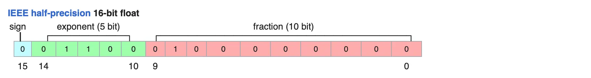
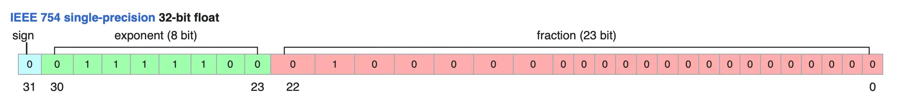

# 计算机数据类型与表示方法

在计算机科学和数据处理领域，数据类型和表示方法是非常重要的概念。它们决定了数据的存储方式、计算精度和内存占用。不同的数据类型和表示方法适用于不同的应用场景，选择合适的数据类型可以提高计算效率、减少内存占用和改善数据精度。

需要注意的是，计算机内部的运算是基于二进制的，而不是我们常用的十进制。二进制系统使用0和1两个数字来表示信息，而十进制系统使用0到9十个数字来表示信息。这种差异使得计算机内部的数据表示和运算方式与我们日常生活中的数学运算有很大不同。

例如，在十进制系统中，我们可以使用小数来表示分数，但是计算机内部使用二进制来表示小数，这使得计算机内部的浮点数运算变得非常复杂。同样，在十进制系统中，我们可以使用整数来表示计数，但是计算机内部使用二进制来表示整数，这使得计算机内部的整数运算变得非常快速。

# 整数数据类型

整数数据类型是计算机科学中最基本的数据类型之一，它用于表示整数值。整数数据类型可以分为两种：无符号整数和有符号整数。

# 1. 无符号整数

$\quad$ 无符号整数是指只能表示非负整数的整数数据类型，它的所有位都可以用来表示整数，即最左一位与其右各位一样用于表示数值，所以无符号整数的取值范围从 $0 \sim 2^n-1$，其中$n$是位数。即：$max(\text{uint}n)=\underbrace {1111 ... 1111}_{n位} = 1 + 2^1 + 2^2 + 2^3 + ... + 2^{n-1}=2^n - 1 = 2^n - 1$。
- uint2：2位无符号整数，取值范围：$0 \sim 2^2-1,即 0\sim3$
- uint4：4位无符号整数，取值范围：$0 \sim 2^4-1,即 0\sim15$
- uint8：8位无符号整数，取值范围：$0 \sim 2^8-1,即 0\sim255$
- uint16：16位无符号整数，取值范围：$0 \sim 2^{16}-1,即 0\sim65535$
- uint32：32位无符号整数，取值范围：$0 \sim 2^{32}-1,即 0\sim4294967295$
- uint64：64位无符号整数，取值范围：$0 \sim 2^{64}-1,即 0\sim18446744073709551615$

# 2. 有符号整数

$\quad$ 有符号整数是指可以表示负整数和非负整数的整数数据类型。有符号整数的表示方式有多种，包括 原码、一补码、补码，其中补码是现在计算机中最常用的表示方式。

1. 原码

$\quad$ 原码是一种简单的有符号整数表示方式。它使用一个单独的位来表示数的符号（0表示正数，1表示负数），其余位表示数值。

例如，一个8位原码可以表示为：
- 正数：`0xxxxxxx`，数值10的原码表示：`00001010`
- 负数：`1xxxxxxx`，数值-10的原码表示：`10001010`

原码的优点是简单易懂，但是它有一个缺点：加法和减法操作需要单独处理符号位，这使得硬件实现变得复杂。

2. 一补码

$\quad$ 一补码是一种改进的有符号整数表示方式。它使用按位NOT运算来反转数的位以表示负值。

例如，一个8位一补码可以表示为：

- 正数：`0xxxxxxx`,数值10的一补码表示：`00001010`
- 负数：`1xxxxxxx` 数值-10的一补码表示：`11110101`(原码为1+0001010，数值位0001010， 取反后为1110101，然后在最前面加上符号位1)。

一补码的优点是可以简化加法和减法操作，但是它有两个表示零的方式（00000000和11111111），这可能会在某些情况下引发问题。

3. 补码

$\quad$ 补码是一种常用的有符号整数表示方式。它使用按位NOT运算来反转数的位，然后加1以表示负值。

例如，一个8位补码可以表示为：

正数：0xxxxxxx, 数值10的补码表示： 00001010
负数：1xxxxxxx, 数值-10的补码表示：11110110 (取反后加1)

补码的优点是可以简化加法和减法操作，并且只有一个表示零的方式（00000000）。这使得硬件实现变得更加高效。

| 表示方式 | 最大值 | 最小值 | 正数 | 负数 |
| --- | --- | --- | --- | --- |
| 原码 | $2^{n-1} - 1$ | $-2^{n-1}$ | 0xxxxxxx  | 1xxxxxxx  |
| 一补码 | $2^{n-1} - 1$ | $-(2^{n-1} - 1)$ | 0xxxxxxx  | 1xxxxxxx 取反后 |
| 补码 | $2^{n-1} - 1$ | $-2^{n-1}$ | 0xxxxxxx | 1xxxxxxx 取反后加1 |

则不同位补码的曲直范围为：
- int2：2位有符号整数，取值范围：-2~1
- int4：4位有符号整数，取值范围：-8~7
- int8：8位有符号整数，取值范围：-128~127
- int16：16位有符号整数，取值范围：-32768~32767
- int32：32位有符号整数，取值范围：-2147483648~2147483647
- int64：64位有符号整数，取值范围：-9223372036854775808~9223372036854775807

# 3. 浮点数数据类型

浮点数数据类型是一种用于表示小数的数据类型。它使用二进制表示法来存储小数值，包括整数部分和小数部分。

## 浮点数的表示方式
浮点数的表示方式通常使用以下格式：

sign bit、exponent bit、fraction bit。

其中：

- sign bit：符号位，表示浮点数的符号（0表示正数，1表示负数）。
- exponent bit：指数部分，表示浮点数的指数值。
- fraction bit：尾数部分，表示浮点数的小数部分。

## 浮点数的分类
浮点数可以分为以下几种：

**单精度浮点数（Single Precision Floating Point）**：使用32位二进制表示法，包括1位符号位、8位指数部分和23位尾数部分。
$x = (-1)^s 2^{E-15} （1 + fraction / ）$

**双精度浮点数（Double Precision Floating Point）**：使用64位二进制表示法，包括1位符号位、11位指数部分和52位尾数部分。

**扩展精度浮点数（Extended Precision Floating Point）**：使用80位二进制表示法，包括1位符号位、15位指数部分和64位尾数部分。

## 浮点数的转换规则

$\quad$ 浮点数的转换规则是将符号位、指数部分、尾数部分转换为具体的数值。下面是浮点数的转换规则：

1. 符号位（Sign Bit）
符号位用于表示浮点数的符号。符号位为0表示正数，符号位为1表示负数。

2. 指数部分（Exponent）
指数部分用于表示浮点数的指数值。指数部分是一个无符号整数，它的值范围是从0到2^(指数位数)-1。指数部分的值需要加上一个偏移值（bias），以便将指数值转换为真正的指数值。例如，在单精度浮点数中，指数部分是8位的，无符号整数值范围是从0到255。偏移值是127，因此指数值的范围是从-126到127。

3. 尾数部分（Fraction bit）
尾数部分用于表示浮点数的小数部分。尾数部分是一个二进制小数，它的值范围是从0到1。尾数部分的值需要左移一定的位数，以便将小数部分转换为真正的小数值。例如，在单精度浮点数中，尾数部分是23位的，二进制小数值范围是从0到1。左移23位后，小数部分的值范围是从0到1.999999999999999。

4. 转换规则
将符号位、指数部分、尾数部分转换为具体的数值的规则是：

    - 如果符号位为0，则浮点数为正数。
    - 如果符号位为1，则浮点数为负数。
    - 指数值 = 指数部分的值 + 偏移值。
    - 小数值 = 尾数部分的值 × 2^(-指数值)。
    - 浮点数的值 = 符号位 × 小数值。

例如，在单精度浮点数中，符号位为0，指数部分的值为130，尾数部分的值为0.101010101010101010101010。则：
- 符号位为0，浮点数为正数。
- 指数值 = 130 + 127 = 257。
- 小数值 = 0.101010101010101010101010 × 2^(-257) ≈ 0.5。
- 浮点数的值 = 0 × 0.5 = 0.5。
- 因此，浮点数的值是0.5。

## 浮点数的缺点是：

- **精度有限**：可能出现舍入误差。
- **溢出**：操作浮点数可能出现溢出或下溢错误。

# Bfloat16

Bfloat16和Float16都是16位浮点数类型，但是它们有着不同的设计目标和实现方式。

**精度**：
Float16是一种传统的16位浮点数类型，它的精度相对较低。 Float16的尾数部分只有10位，因此它的精度只有约3.3位有效数字。相比之下，Bfloat16的尾数部分有7位，但是它的指数部分有8位，这使得Bfloat16的精度相对较高。 Bfloat16的精度约为5位有效数字。

**表示范围**：Float16的表示范围是从约1.4e-45到约3.4e38，而Bfloat16的表示范围是从约1.4e-38到约3.4e38。可以看到，Bfloat16的表示范围比Float16更广。

**应用场景**：Float16主要应用于图形处理、游戏开发和科学计算等领域，而Bfloat16主要应用于机器学习和深度学习模型。

**存储空间**：Float16和Bfloat16都占16位的存储空间，相比Float32来说,它们都可以减少存储空间的占用。

